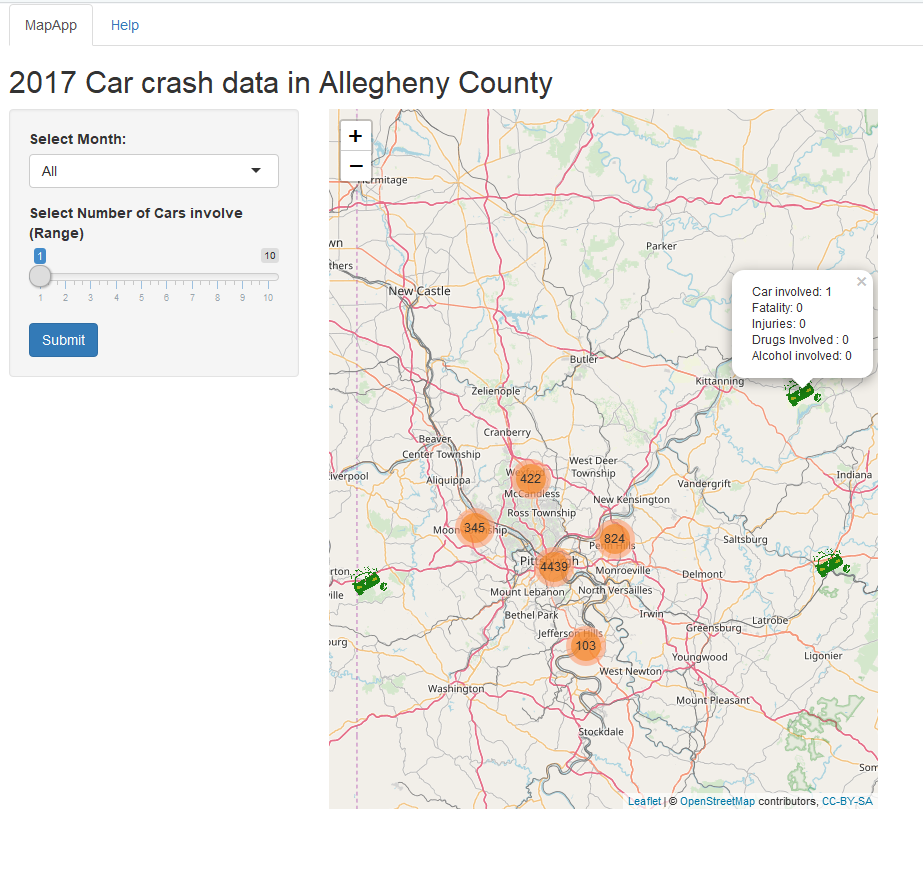

Reproducible Pitch Presentation 
========================================================

Author: Omer Shechter

Date: 2 December 2018 


2017 Car crash data in Allegheny County
========================================================
transition: rotate

<font size = "5">This Application uses data about car's accidents in Allegheny County in the US, To demonstrate various capabilities from the Developing Data Products Course.
The Application provides visualization about car accidents in Allegheny County in 2017.


- Using Shiny UI Server Application. 
- Using Leaflet interactive MAP application. 
- Adding customized markers, and Popup. 
- Two Input Widget (Drop down list and Slide Bar).
- Using Reactive function. 
- Server Business logic (Subsetting data frame based on input).
- Full help page (Documentation)</font>.

<font size = "6">Shiny Applicatio Link : https://omersect.shinyapps.io/project/ </font>
<font size = "6">Github Repository Link : https://github.com/omershect/Course-Project-Shiny-Application-and-Reproducible-Pitch </font>


The Data 
========================================================
transition: rotate
<font size = "5">
- Data link: https://data.wprdc.org/datastore/dump/bf8b3c7e-8d60-40df-9134-21606a451c1a
- Data contains information on all accidents in Allegheny County in 2017.
- Data used: </font>
<font size = "4">
- Geo Location data. 
- Months of the Accident. 
- AUTOMOBILE_COUNT -  the number of cars involved. 
- FATAL_COUNT - Total number of death. 
- ILLEGAL_DRUG_RELATED - Ilegal drug involvement. 
- DRINKING_DRIVER Number of Drunk People involved in the car accident. 
- INJURY_COUNT - Number of injuries. 
- Fatal And INJURY - Will be used to classifying the type of the accident 
    And create different Icons. 


</font>
Data and Server calculations 
========================================================
The following calculations are done in the server :
- Load data. 
- Subset data - remove the accidents with zero cars involved. 
- Remove NA items.
- Create new columns which classify the accident (Death/Injury/None).
- Check the Min and Max cars number involved and pass it to the slider input.
- Slice the dataset dynamically based on Month selection and the number of cars selection. 


Data and Server calculation (Cont.)
========================================================

<font size = "7">
Data str
</font>
<font size = "5">

```
'data.frame':	9690 obs. of  12 variables:
 $ latitude        : num  40.5 40.4 40.4 40.4 40.5 ...
 $ longitude       : num  -79.9 -80 -80 -79.8 -79.9 ...
 $ Month Crash     : int  1 1 1 1 1 1 1 1 1 1 ...
 $ No.Cars.Involved: int  2 1 1 1 4 2 2 1 2 3 ...
 $ Drinking.Driver : int  0 0 0 0 1 0 0 0 0 0 ...
 $ Death.Count     : int  0 0 0 0 0 0 0 0 0 0 ...
 $ Drug.Involved   : int  0 0 0 0 0 0 0 0 0 0 ...
 $ Injury.Count    : int  0 0 2 0 0 0 1 0 1 1 ...
 $ Fatality.ind    : int  0 0 0 0 0 0 0 0 0 0 ...
 $ Injury.ind      : int  0 0 1 0 0 0 1 0 1 1 ...
 $ Month.Crash.Name: chr  "January" "January" "January" "January" ...
 $ Death_Injuries  : Factor w/ 3 levels "Death","Injury",..: 3 3 2 3 3 3 2 3 2 2 ...
```
</font>
<font size = "7">
Summary of accidents per classification 

</font>

```

 Death Injury   None 
    32   3997   5661 
```

</font>


Shiny App
========================================================


